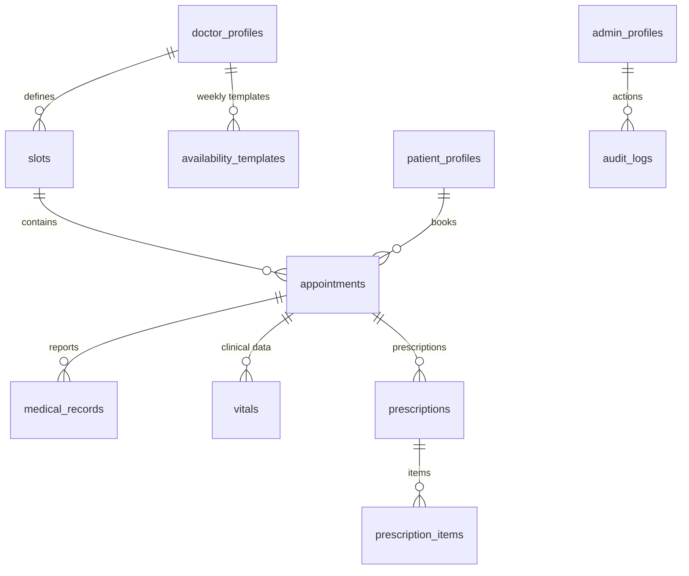

# Architecture Overview

**Project**: HealthConnect — Clinical Queue & Scheduling Platform  
**Architecture Style**: Modular Monolith with Serverless Realtime  
**Last Updated**: 2026-05-06

---

## System Overview

HealthConnect is a full-stack clinical scheduling engine that manages patient appointment flows, doctor workload, priority-based queue management, and medical documentation — all in real-time.

```
┌─────────────────────────────────────────┐
│              React Frontend              │
│  (Vite + TypeScript + Tailwind CSS)      │
│  Roles: Patient | Doctor | Receptionist │
│         Admin                           │
└──────────────────┬──────────────────────┘
                   │ REST API (Axios)
                   ▼
┌─────────────────────────────────────────┐
│           FastAPI Backend                │
│         (Python 3.11 + Uvicorn)         │
│   /api/v1/{auth,appointments,doctors,   │
│    admin,history,clinical,schedules,    │
│    analytics,emergency,optimization}    │
└──────┬──────────────────────┬───────────┘
       │                      │
       ▼                      ▼
┌─────────────┐      ┌─────────────────────┐
│  PostgreSQL  │      │   Supabase Auth     │
│ (Supabase)  │      │  (JWT + Metadata)   │
│ SQLAlchemy  │      │  Role stored in     │
│   ORM       │      │  user_metadata      │
└─────────────┘      └─────────────────────┘
                              │
                              ▼
                    ┌─────────────────────┐
                    │  Supabase Storage   │
                    │  (Medical Records)  │
                    │  S3-Compatible      │
                    └─────────────────────┘
```

---

## Core Architectural Layers

### 1. Identity Layer
- **Technology**: Supabase Auth
- **Roles**: `DOCTOR`, `PATIENT`, `ADMIN`, `RECEPTIONIST` (stored in `user_metadata`)
- **Token**: JWT Bearer token, validated server-side via `get_current_user` dependency
- **Profile Sync**: On signup, a corresponding profile row is atomically created in `doctor_profiles`, `patient_profiles`, or `admin_profiles`
- **Admin Creation**: Uses `SUPABASE_SERVICE_ROLE_KEY` (bypasses email verification) — stored in `backend/.env`

### 2. Scheduling & Queue Layer
- Slot-based time blocks generated from weekly availability templates
- Priority scoring engine assigns a numeric score per appointment based on:
  - `base_priority` (from patient profile)
  - Wait time accumulation
  - Manual bumps by receptionist
- Overbooking safety valves enforce capacity limits and doctor fatigue detection (40-min overrun threshold)

### 3. Intelligence Layer
- Rolling average consultation time calculated per-doctor after each `COMPLETED` appointment
- Powers estimated wait time calculations on the patient booking page
- `manual_speed_factor` on doctor profile allows manual override

### 4. Clinical Layer
- Doctors can record structured vitals (`Vitals` table), ICD-10 diagnosis codes, clinical notes, and multi-item prescriptions
- All clinical data is linked to an `Appointment` record for longitudinal traceability

### 5. History & Records Layer
- Full medical timeline view per patient
- Medical files stored in **Supabase Storage** (S3-compatible) and referenced via URL in `medical_records`
- Access-controlled: doctors and the patient themselves can view their own records

### 6. Analytics Layer
- Real-time reception dashboard: queue count, conflicts, capacity
- Admin analytics: system-wide KPIs, hourly booking volume, doctor load heatmap
- Storm Detection: monitors cancellation velocity to trigger early warnings

### 7. Pagination Layer *(added 2026-05-06)*
- All list-returning endpoints now use a standardized `PaginatedResponse[T]` schema
- `paginate(query, page, limit)` utility abstracts SQLAlchemy `offset`/`limit` slicing
- Default page size: **10 items**
- Frontend components use `res.data.items || res.data` for graceful backward compatibility

---

## Security Model

| Concern | Mechanism |
|---------|-----------|
| Authentication | Supabase JWT — validated server-side per request |
| Role enforcement | `check_admin()` / role checks inside route handlers |
| Admin user creation | Requires `SUPABASE_SERVICE_ROLE_KEY` (never exposed to frontend) |
| Password Reset | 6-digit OTP via SMTP, 10-minute expiry, single-use |
| Medical data | Access-controlled per patient_id vs current user |
| CORS | Currently `allow_origins=["*"]` — tighten for production |

---

## Infrastructure & Storage

### Medical Record Storage
- **System**: Supabase Storage (S3-Compatible)
- **Region**: `ap-south-1`
- **Bucket**: `records`
- **Access**: Pre-signed URL or direct streaming via backend

### Email (OTP & Notifications)
- **Service**: Custom SMTP-based `EmailService` (`app/services/email_service.py`)
- Sends: OTP password reset codes, account verification codes, appointment alerts

---

## Data Model Summary



---

## Directory Structure

```
healthconnect/
├── backend/
│   ├── main.py                     # FastAPI app, router registration, middleware
│   ├── app/
│   │   ├── api/v1/                 # Route handlers
│   │   │   ├── auth.py             # Signup, login, OTP reset
│   │   │   ├── admin.py            # User mgmt, settings, audit logs
│   │   │   ├── appointments.py     # Booking, queue actions, clinical notes
│   │   │   ├── doctors.py          # Doctor listing and profile
│   │   │   ├── patients.py         # Patient profile
│   │   │   ├── history.py          # Clinical timelines
│   │   │   ├── clinical.py         # Vitals, prescriptions, ICD-10
│   │   │   ├── schedules.py        # Availability templates + slot launch
│   │   │   ├── slots.py            # Slot querying
│   │   │   ├── analytics.py        # Dashboard & admin KPIs
│   │   │   ├── optimization.py     # Gap compaction
│   │   │   └── emergency.py        # Bulk rescheduling
│   │   ├── models/                 # SQLAlchemy ORM models
│   │   ├── schemas/                # Pydantic schemas (incl. pagination.py)
│   │   ├── services/               # Business logic (email, analytics)
│   │   └── core/                   # DB, Supabase clients, config
│   └── alembic/                    # Database migrations
│
├── frontend/
│   └── src/
│       ├── pages/                  # Route-level React components
│       ├── components/             # Shared UI components
│       ├── context/                # AuthContext (role, token management)
│       ├── api/                    # Axios instance with base URL
│       └── App.tsx                 # Router + route protection
│
└── docs/                           # Project documentation
```
