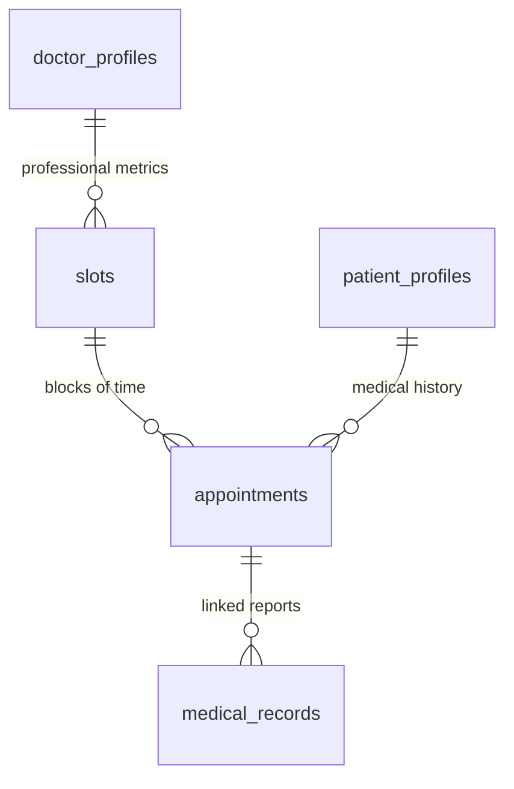

# Architecture Overview

HealthConnect is a data-driven scheduling engine designed for high reliability and clinical precision.

## Core Layers

1.  **Identity Layer**: Manages roles (Doctor/Patient) and unified signup via Supabase Auth metadata.
2.  **Intelligence Layer**: Tracks consultation speeds and calculates rolling averages to dynamically adjust slot durations.
3.  **Clinical Layer**: Enables medical documentation, diagnosis tracking, and secure record storage.
4.  **History Layer**: Provides a chronological clinical timeline for every patient.

## Infrastructure & Storage

### Medical Record Storage
- **System**: Supabase Storage (S3-Compatible)
- **Region**: `ap-south-1`
- **Bucket**: `records`
- **Endpoint**: `https://[id].storage.supabase.co/storage/v1`
- **Security**: Access keys (AWS_ACCESS_KEY_ID) are managed in the backend to provide pre-signed URL access or mediated file streaming, ensuring patients' privacy.

## Data Model

