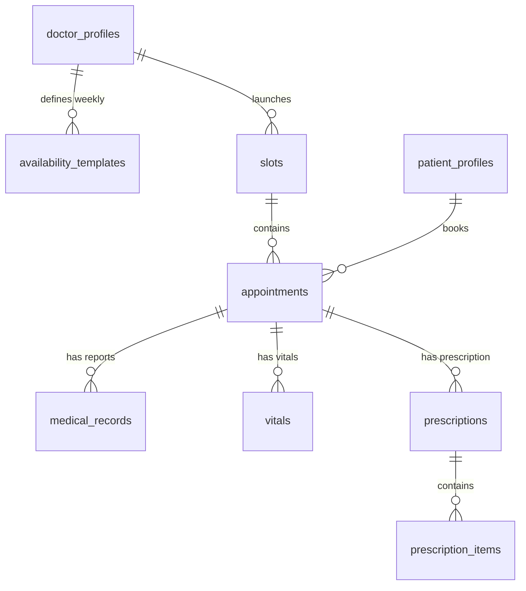

# Database Schema

HealthConnect uses a Supabase-managed PostgreSQL database.

## Tables

### `slots`
- `id`: UUID (PK)
- `doctor_id`: UUID
- `start_time`: TIMESTAMPTZ
- `end_time`: TIMESTAMPTZ
- `status`: VARCHAR
- `max_capacity`: INTEGER

### `appointments`
- `id`: UUID (PK)
- `patient_id`: UUID
- `slot_id`: UUID (FK)
- `status`: VARCHAR
- `queue_token`: VARCHAR
- `priority_score`: INTEGER
- `reschedule_count`: INTEGER (Fairness tracking)
- `wait_start_time`: TIMESTAMPTZ (Queue entry time)
- **Clinical Tracking**:
    - `clinical_notes`: TEXT (Doctor's notes)
    - `diagnosis`: TEXT (Clinical diagnosis)
    - `actual_start_time`: TIMESTAMPTZ
    - `actual_end_time`: TIMESTAMPTZ
    - `consultation_duration`: INTEGER

### `medical_records`
Stores links to files uploaded to Supabase Storage.
- `id`: UUID (PK)
- `appointment_id`: UUID (FK, Optional)
- `patient_id`: UUID (FK)
- `doctor_id`: UUID (FK)
- `file_url`: VARCHAR (Supabase Storage URL)
- `file_type`: VARCHAR (e.g., LAB_REPORT, PRESCRIPTION)
- `description`: VARCHAR
- `created_at`: TIMESTAMPTZ

### `doctor_profiles`
- `id`: UUID (PK)
- `user_id`: UUID
- `full_name`: VARCHAR
- `specialty`: VARCHAR
- `bio`: TEXT
- `avg_consultation_time`: INTEGER
- `manual_speed_factor`: FLOAT

### `patient_profiles`
- `id`: UUID (PK)
- `user_id`: UUID
- `full_name`: VARCHAR
- `date_of_birth`: DATE
- `gender`: VARCHAR
- `base_priority`: INTEGER

### `availability_templates`
- `id`: UUID (PK)
- `doctor_id`: String (FK to doctor_profiles.custom_id)
- `day_of_week`: INTEGER (0=Mon, 6=Sun)
- `start_time`: TIME
- `end_time`: TIME
- `is_active`: BOOLEAN
- [x] Correctly checks for existing slots before generation
- [x] Includes `uix_doctor_slot_time` unique constraint

### `vitals`
- `id`: UUID (PK)
- `appointment_id`: UUID (FK)
- `patient_id`: String (FK)
- `bp_systolic`: INTEGER
- `bp_diastolic`: INTEGER
- `heart_rate`: INTEGER
- `spo2`: INTEGER
- `temperature`: FLOAT
- `weight`: FLOAT
- `recorded_at`: TIMESTAMPTZ

### `prescriptions`
- `id`: UUID (PK)
- `appointment_id`: UUID (FK)
- `patient_id`: String (FK)
- `doctor_id`: String (FK)
- `notes`: TEXT
- `created_at`: TIMESTAMPTZ

### `prescription_items`
- `id`: UUID (PK)
- `prescription_id`: UUID (FK)
- `medicine_name`: VARCHAR
- `dosage`: VARCHAR
- `frequency`: VARCHAR
- `duration`: VARCHAR
- `instructions`: VARCHAR

## Relationships

