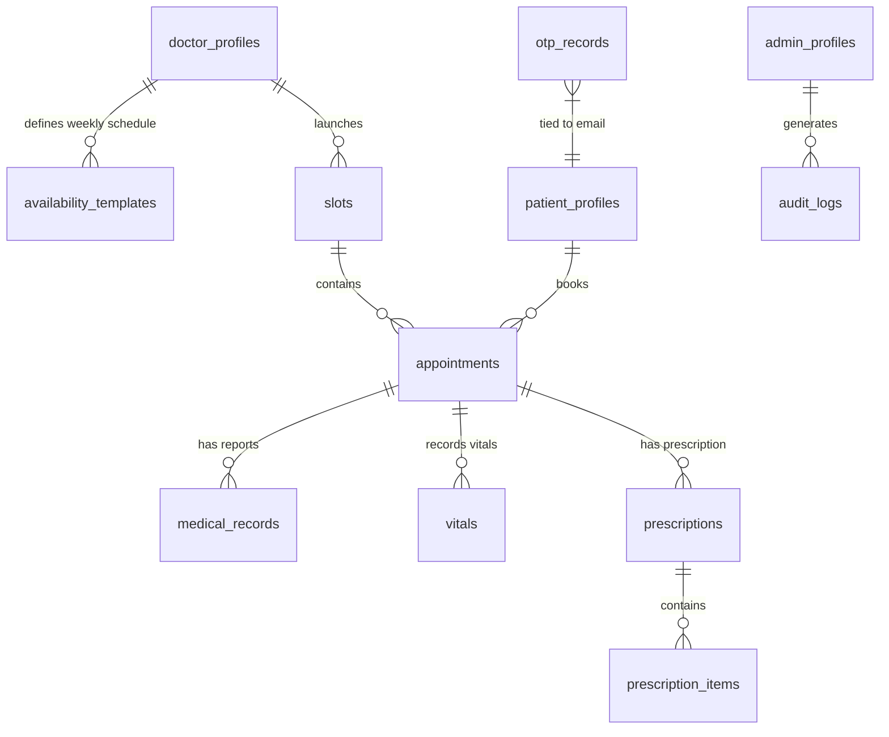

# Database Schema

**Database**: Supabase-managed PostgreSQL  
**ORM**: SQLAlchemy 2.0 (Synchronous)  
**Last Updated**: 2026-05-06

---

## Tables

### `doctor_profiles`
Stores professional metadata for every doctor in the system.

| Column | Type | Notes |
|--------|------|-------|
| `id` | UUID (PK) | Auto-generated |
| `user_id` | UUID | References Supabase Auth `users.id` |
| `custom_id` | VARCHAR | Format: `mobile[:5]-name[:4].upper()` e.g. `98765-JOHN` |
| `full_name` | VARCHAR | |
| `email` | VARCHAR | |
| `mobile` | VARCHAR | |
| `specialty` | VARCHAR | Default: `"General"` |
| `bio` | TEXT | Optional |
| `avg_consultation_time` | INTEGER | Rolling average in minutes |
| `manual_speed_factor` | FLOAT | Override multiplier for scheduling engine |

---

### `patient_profiles`
Stores patient demographic and medical metadata.

| Column | Type | Notes |
|--------|------|-------|
| `id` | UUID (PK) | Auto-generated |
| `user_id` | UUID | References Supabase Auth `users.id` |
| `custom_id` | VARCHAR | Format: `mobile[:5]-name[:4].upper()` |
| `full_name` | VARCHAR | |
| `email` | VARCHAR | |
| `mobile` | VARCHAR | |
| `date_of_birth` | DATE | Optional |
| `gender` | VARCHAR | Optional |
| `base_priority` | INTEGER | Default: `0`. Seed for priority score calculation |
| `medical_history` | TEXT | Optional free-text |
| `status` | VARCHAR | `ACTIVE` or `INACTIVE`. Managed by Admin |

---

### `admin_profiles`
Tracks Admin users for internal access control and audit logging.

| Column | Type | Notes |
|--------|------|-------|
| `id` | UUID (PK) | |
| `user_id` | UUID | References Supabase Auth `users.id` |
| `full_name` | VARCHAR | |
| `email` | VARCHAR | |

---

### `slots`
Represents a time block during which a doctor is available for appointments.

| Column | Type | Notes |
|--------|------|-------|
| `id` | UUID (PK) | |
| `doctor_id` | VARCHAR | FK → `doctor_profiles.custom_id` |
| `start_time` | TIMESTAMPTZ | |
| `end_time` | TIMESTAMPTZ | |
| `status` | VARCHAR | `OPEN` or `CLOSED` |
| `max_capacity` | INTEGER | Default: 1. Max patients per slot |

---

### `appointments`
Core operational table. Tracks every booking, its lifecycle, and clinical outcomes.

| Column | Type | Notes |
|--------|------|-------|
| `id` | UUID (PK) | |
| `patient_id` | VARCHAR | FK → `patient_profiles.custom_id` |
| `slot_id` | UUID | FK → `slots.id` |
| `source` | VARCHAR | `ONLINE`, `WALK_IN`, or `EMERGENCY` |
| `status` | VARCHAR | `PENDING` → `CONFIRMED` → `IN_PROGRESS` → `COMPLETED` \| `CANCELLED` |
| `queue_token` | VARCHAR | Unique display token (e.g., `Q-001`) |
| `priority_score` | INTEGER | Computed score for queue ordering |
| `reschedule_count` | INTEGER | Tracks fairness — how many times rescheduled |
| `wait_start_time` | TIMESTAMPTZ | When patient joined the queue |
| `actual_start_time` | TIMESTAMPTZ | When consultation physically began |
| `actual_end_time` | TIMESTAMPTZ | When consultation physically ended |
| `consultation_duration` | INTEGER | Derived: end−start in minutes |
| `status_changed_at` | TIMESTAMPTZ | Auto-updated on every status change |
| `clinical_notes` | TEXT | Doctor's free-text notes |
| `diagnosis` | TEXT | Formal diagnosis (ICD-10 code or text) |
| `rating` | INTEGER | 1–5 stars from patient |
| `feedback` | TEXT | Free-text patient feedback |
| `created_at` | TIMESTAMPTZ | Server default |

---

### `availability_templates`
Weekly recurring schedule blocks that drive slot generation.

| Column | Type | Notes |
|--------|------|-------|
| `id` | UUID (PK) | |
| `doctor_id` | VARCHAR | FK → `doctor_profiles.custom_id` |
| `day_of_week` | INTEGER | `0` = Monday … `6` = Sunday |
| `start_time` | TIME | |
| `end_time` | TIME | |
| `is_active` | BOOLEAN | Default: `true` |

**Constraints**: `uix_doctor_slot_time` unique constraint prevents duplicate templates.

---

### `medical_records`
Stores metadata and Supabase Storage URLs for uploaded medical files.

| Column | Type | Notes |
|--------|------|-------|
| `id` | UUID (PK) | |
| `appointment_id` | UUID | FK → `appointments.id` (optional) |
| `patient_id` | VARCHAR | FK → `patient_profiles.custom_id` |
| `doctor_id` | VARCHAR | FK → `doctor_profiles.custom_id` |
| `file_url` | VARCHAR | Public/pre-signed Supabase Storage URL |
| `file_type` | VARCHAR | e.g., `LAB_REPORT`, `PRESCRIPTION`, `SCAN` |
| `description` | VARCHAR | |
| `created_at` | TIMESTAMPTZ | |

---

### `vitals`
Clinical vitals recorded per appointment.

| Column | Type | Notes |
|--------|------|-------|
| `id` | UUID (PK) | |
| `appointment_id` | UUID | FK → `appointments.id` |
| `patient_id` | VARCHAR | FK → `patient_profiles.custom_id` |
| `bp_systolic` | INTEGER | mmHg |
| `bp_diastolic` | INTEGER | mmHg |
| `heart_rate` | INTEGER | BPM |
| `spo2` | INTEGER | Percentage |
| `temperature` | FLOAT | Celsius |
| `weight` | FLOAT | kg |
| `recorded_at` | TIMESTAMPTZ | |

---

### `prescriptions`
Header record for a multi-item prescription.

| Column | Type | Notes |
|--------|------|-------|
| `id` | UUID (PK) | |
| `appointment_id` | UUID | FK → `appointments.id` |
| `patient_id` | VARCHAR | FK → `patient_profiles.custom_id` |
| `doctor_id` | VARCHAR | FK → `doctor_profiles.custom_id` |
| `notes` | TEXT | General prescription notes |
| `created_at` | TIMESTAMPTZ | |

---

### `prescription_items`
Individual medication line items within a prescription.

| Column | Type | Notes |
|--------|------|-------|
| `id` | UUID (PK) | |
| `prescription_id` | UUID | FK → `prescriptions.id` |
| `medicine_name` | VARCHAR | |
| `dosage` | VARCHAR | e.g., `500mg` |
| `frequency` | VARCHAR | e.g., `Twice daily` |
| `duration` | VARCHAR | e.g., `7 days` |
| `instructions` | VARCHAR | e.g., `Take after meals` |

---

### `notifications`
System-generated patient alerts.

| Column | Type | Notes |
|--------|------|-------|
| `id` | UUID (PK) | |
| `patient_id` | VARCHAR | FK → `patient_profiles.custom_id` |
| `type` | VARCHAR | `COME_EARLY`, `CANCEL`, `RESCHEDULE` |
| `message` | TEXT | |
| `status` | VARCHAR | `SENT` or `READ` |
| `created_at` | TIMESTAMPTZ | |

---

### `system_settings`
Key-value store for configurable system behaviour.

| Column | Type | Notes |
|--------|------|-------|
| `id` | UUID (PK) | |
| `key` | VARCHAR | Unique config key |
| `value` | VARCHAR | String-encoded value |

---

### `audit_logs`
Immutable record of all admin actions for compliance.

| Column | Type | Notes |
|--------|------|-------|
| `id` | UUID (PK) | |
| `action` | VARCHAR | e.g., `USER_CREATED`, `USER_ROLE_CHANGE` |
| `performed_by` | VARCHAR | Email of the admin who performed the action |
| `details` | TEXT | Human-readable description |
| `timestamp` | TIMESTAMPTZ | Auto-set on creation |

---

### `otp_records`
Stores OTP codes for password reset flows.

| Column | Type | Notes |
|--------|------|-------|
| `id` | UUID (PK) | |
| `email` | VARCHAR | Lowercase-normalized |
| `otp_code` | VARCHAR | 6-digit numeric string |
| `purpose` | VARCHAR | `RESET_PASSWORD` |
| `is_used` | BOOLEAN | Default: `false`. Marked `true` after use |
| `expires_at` | TIMESTAMPTZ | 10 minutes from creation |
| `created_at` | TIMESTAMPTZ | |

---

## Entity Relationship Diagram

