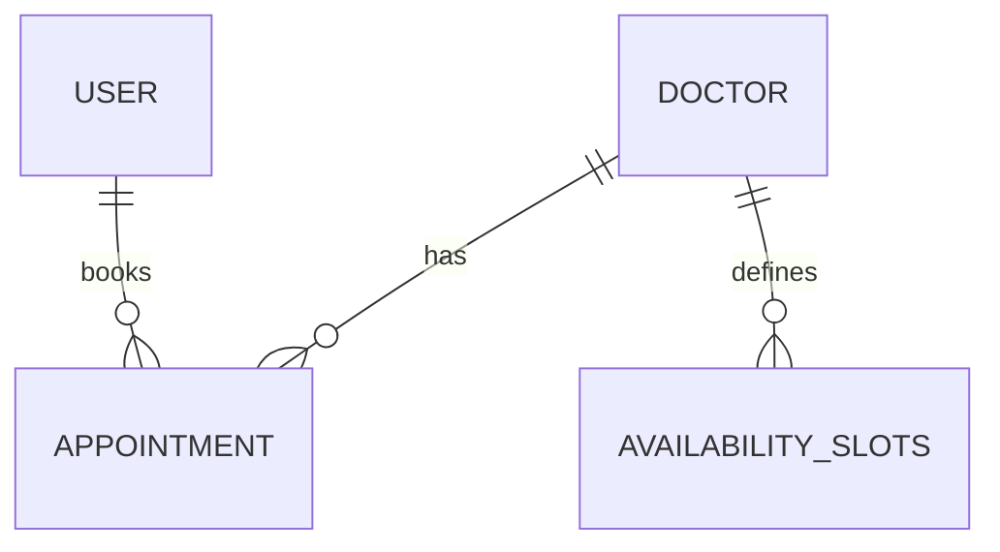

# Database Schema

This document outlines the PostgreSQL schema for HealthConnect.

## Tables

### 1. `doctors`
Stores information about medical professionals.
- `id` (UUID, PK)
- `full_name` (Text)
- `specialty` (Text)
- `fatigue_score` (Integer): 0-100 scale.
- `is_available` (Boolean)
- `created_at` (Timestamp)

### 2. `appointments`
Tracks patient bookings.
- `id` (UUID, PK)
- `patient_id` (UUID, FK to auth.users): Links to Supabase Auth.
- `doctor_id` (UUID, FK to doctors)
- `start_time` (Timestamp)
- `end_time` (Timestamp)
- `status` (Enum): `pending`, `confirmed`, `cancelled`, `completed`, `rescheduled`.
- `priority` (Integer): Higher number = Higher priority.
- `is_overbooked` (Boolean): Flagged by the Conflict Resolver.

### 3. `availability_slots`
Specific time blocks where a doctor is available.
- `id` (UUID, PK)
- `doctor_id` (UUID, FK to doctors)
- `start_time` (Timestamp)
- `end_time` (Timestamp)
- `is_booked` (Boolean)

## Entity Relationship Diagram (Conceptual)

