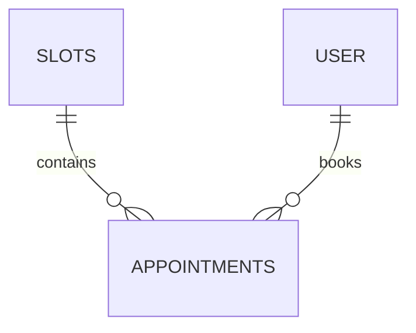

# Database Schema

This document outlines the PostgreSQL schema for HealthConnect.

## Tables

### 1. `slots`
Represents the available time blocks for doctors.
- `id` (UUID, PK)
- `doctor_id` (UUID): Reference to the doctor user.
- `start_time` (Timestamp with Timezone)
- `end_time` (Timestamp with Timezone)
- `status` (String): `OPEN`, `CLOSED`, `OVERBOOKED`, `CANCELLED`.
- `max_capacity` (Integer): Default 1.

### 2. `appointments`
Tracks patient bookings and real-time consultation performance.
- `id` (UUID, PK)
- `patient_id` (UUID): Links to the patient user.
- `slot_id` (UUID, FK to `slots`): Links to the specific time block.
- `status` (String): `PENDING`, `CONFIRMED`, `BUMPED`, `CANCELLED`, `IN_PROGRESS`, `COMPLETED`.
- `queue_token` (String, Unique): Publicly shareable token for queue tracking.
- `priority_score` (Integer): Used by the Stabilizer for bumping decisions.
- `actual_start_time` (Timestamp): Recorded when "Call" is clicked.
- `actual_end_time` (Timestamp): Recorded when "Complete" is clicked.
- `consultation_duration` (Integer): Calculated duration in minutes.

## Entity Relationship Diagram

