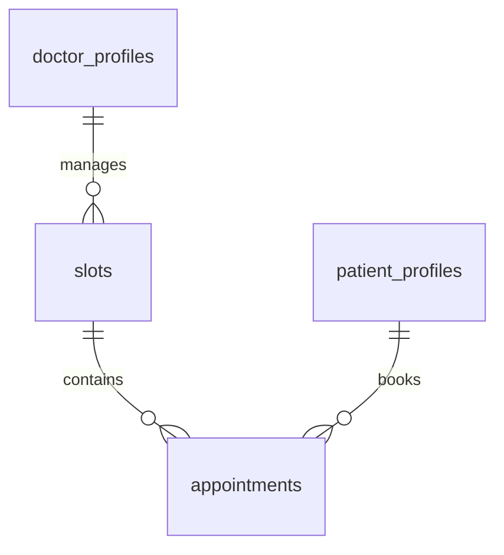

# Database Schema

HealthConnect uses a Supabase-managed PostgreSQL database. The schema is designed for high-concurrency scheduling and real-time performance tracking.

## Tables

### `slots`
Defines blocks of time where a doctor is available.
- `id`: UUID (PK)
- `doctor_id`: UUID (Links to Supabase Auth user)
- `start_time`: TIMESTAMPTZ
- `end_time`: TIMESTAMPTZ
- `status`: VARCHAR (OPEN, CLOSED, OVERBOOKED)
- `max_capacity`: INTEGER (Default 1)

### `appointments`
Defines patient bookings within a slot.
- `id`: UUID (PK)
- `patient_id`: UUID (Links to Supabase Auth user)
- `slot_id`: UUID (FK -> slots.id)
- `status`: VARCHAR (CONFIRMED, IN_PROGRESS, COMPLETED, CANCELLED)
- `queue_token`: VARCHAR (Unique, e.g., HC-A1B2)
- `priority_score`: INTEGER (Calculated from Patient Profile)
- **Tracking Fields**:
    - `actual_start_time`: TIMESTAMPTZ
    - `actual_end_time`: TIMESTAMPTZ
    - `consultation_duration`: INTEGER (Minutes)

### `doctor_profiles`
Professional identity and scheduling intelligence for doctors.
- `id`: UUID (PK)
- `user_id`: UUID (Unique, Auth Link)
- `full_name`: VARCHAR
- `specialty`: VARCHAR
- `bio`: TEXT
- `avg_consultation_time`: INTEGER (Calculated Rolling Average)
- `manual_speed_factor`: FLOAT (Override for scheduler speed)
- `status`: VARCHAR (ACTIVE, IN_ACTIVE)

### `patient_profiles`
Medical identity and priority settings for patients.
- `id`: UUID (PK)
- `user_id`: UUID (Unique, Auth Link)
- `date_of_birth`: DATE
- `gender`: VARCHAR
- `base_priority`: INTEGER (Contributes to appointment priority)
- `medical_history`: TEXT

## Entity Relationship Diagram

